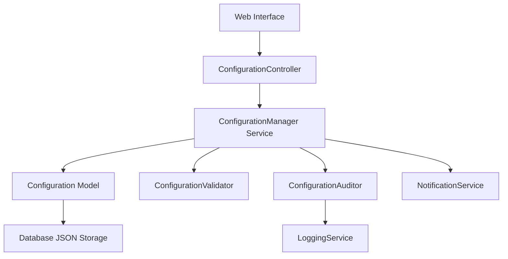

# Configuration Management Design Document

## Overview

The Configuration Management system provides a centralized, web-based interface for managing application settings across the BMS Ops platform. The system extends the existing Settings service pattern to support dynamic configuration management with validation, audit trails, and import/export capabilities. The design leverages Rails' JSON column support for flexible configuration storage while maintaining type safety and validation.

## Architecture

The configuration management system follows a layered architecture:

1. **Presentation Layer**: Web interface built with Rails views following established UI patterns
2. **Service Layer**: ConfigurationManager service class handling business logic and validation
3. **Data Layer**: Configuration model with JSON storage and audit trail support
4. **Integration Layer**: Hooks into existing services for configuration change notifications

### Component Interaction Flow



## Components and Interfaces

### ConfigurationManager Service

The primary service class responsible for all configuration operations:

```ruby
class ConfigurationManager
  # Core configuration operations
  def get_setting(key, environment: 'production')
  def set_setting(key, value, environment: 'production', user: nil)
  def get_category_settings(category, environment: 'production')
  def get_all_settings(environment: 'production')
  
  # Validation and constraints
  def validate_setting(key, value)
  def get_setting_constraints(key)
  
  # Import/Export operations
  def export_configuration(environment: 'production', format: :yaml)
  def import_configuration(data, environment: 'production', user: nil)
  
  # Change management
  def get_change_history(key: nil, limit: 100)
  def revert_setting(key, version, user: nil)
end
```

### Configuration Model

Database model for storing configuration data:

```ruby
class Configuration < ApplicationRecord
  # Fields: key, value (JSON), category, environment, description, constraints (JSON)
  # Indexes: key+environment (unique), category, updated_at
  
  validates :key, presence: true, uniqueness: { scope: :environment }
  validates :environment, presence: true, inclusion: { in: %w[development staging production] }
  validates :category, presence: true
  
  scope :by_category, ->(category) { where(category: category) }
  scope :by_environment, ->(env) { where(environment: env) }
end
```

### ConfigurationAudit Model

Audit trail for configuration changes:

```ruby
class ConfigurationAudit < ApplicationRecord
  # Fields: configuration_key, environment, old_value (JSON), new_value (JSON), 
  #         user_id, action, created_at
  
  belongs_to :user, optional: true
  
  validates :configuration_key, presence: true
  validates :action, inclusion: { in: %w[create update delete import] }
end
```

### ConfigurationController

Web interface controller following established patterns:

```ruby
class ConfigurationController < ApplicationController
  include ApplicationLogging
  
  def index    # List all configurations by category
  def show     # Show specific configuration details
  def edit     # Edit configuration form
  def update   # Update configuration
  def export   # Export configurations
  def import   # Import configurations
  def history  # Show change history
end
```

## Data Models

### Configuration Schema

```sql
CREATE TABLE configurations (
  id INTEGER PRIMARY KEY,
  key VARCHAR(255) NOT NULL,
  value JSON,
  category VARCHAR(100) NOT NULL,
  environment VARCHAR(50) NOT NULL DEFAULT 'production',
  description TEXT,
  constraints JSON,
  created_at DATETIME NOT NULL,
  updated_at DATETIME NOT NULL,
  UNIQUE(key, environment)
);

CREATE INDEX idx_configurations_category ON configurations(category);
CREATE INDEX idx_configurations_environment ON configurations(environment);
CREATE INDEX idx_configurations_updated_at ON configurations(updated_at);
```

### Configuration Audit Schema

```sql
CREATE TABLE configuration_audits (
  id INTEGER PRIMARY KEY,
  configuration_key VARCHAR(255) NOT NULL,
  environment VARCHAR(50) NOT NULL,
  old_value JSON,
  new_value JSON,
  user_id INTEGER,
  action VARCHAR(50) NOT NULL,
  created_at DATETIME NOT NULL,
  FOREIGN KEY (user_id) REFERENCES users(id)
);

CREATE INDEX idx_config_audits_key_env ON configuration_audits(configuration_key, environment);
CREATE INDEX idx_config_audits_created_at ON configuration_audits(created_at);
CREATE INDEX idx_config_audits_user_id ON configuration_audits(user_id);
```

### Configuration Categories

The system organizes configurations into logical categories:

- **aws**: AWS service configurations (regions, buckets, clusters)
- **database**: Database connection and schema settings
- **email**: Email service and notification settings
- **security**: Authentication and authorization settings
- **monitoring**: Logging and health check configurations
- **tenant**: Default tenant configuration templates
- **system**: Core application settings

## Correctness Properties

*A property is a characteristic or behavior that should hold true across all valid executions of a system-essentially, a formal statement about what the system should do. Properties serve as the bridge between human-readable specifications and machine-verifiable correctness guarantees.*
Property 1: Configuration validation consistency
*For any* configuration setting with defined constraints, when a new value is submitted, the validation result should be consistent with the constraint rules
**Validates: Requirements 2.1, 2.4**

Property 2: Configuration persistence and audit trail
*For any* configuration change, when the change is saved, both the configuration value and an audit record should be persisted with complete metadata
**Validates: Requirements 1.4, 4.1**

Property 3: Configuration export completeness
*For any* set of configurations in an environment, when exported, the resulting data should contain all configuration settings with their current values
**Validates: Requirements 3.1**

Property 4: Configuration import validation
*For any* configuration import data, when imported, each setting should be validated before any changes are applied to the system
**Validates: Requirements 3.3, 3.4**

Property 5: Environment isolation
*For any* configuration setting, when managed across different environments, changes in one environment should not affect the values in other environments
**Validates: Requirements 5.2, 5.3**

Property 6: Configuration categorization
*For any* set of configurations, when displayed in the interface, they should be grouped by their assigned categories
**Validates: Requirements 5.1**

Property 7: Configuration access consistency
*For any* configuration key, when requested programmatically, the returned value should match the current stored value for that key and environment
**Validates: Requirements 6.1**

Property 8: Cache invalidation on updates
*For any* configuration value that is cached, when the value is updated, the cache should be invalidated to ensure fresh data access
**Validates: Requirements 6.5**

Property 9: Validation error reporting
*For any* configuration value that fails validation, the system should return specific error messages describing the validation failure
**Validates: Requirements 2.2**

Property 10: Change history chronological ordering
*For any* configuration change history, when displayed, the changes should be ordered chronologically with complete metadata
**Validates: Requirements 4.2, 4.3**

## Error Handling

The configuration management system implements comprehensive error handling:

### Validation Errors
- **Type Mismatch**: When configuration values don't match expected data types
- **Constraint Violations**: When values violate defined constraints (min/max, regex patterns)
- **Dependency Conflicts**: When dependent configurations are incompatible
- **Required Field Missing**: When mandatory configuration fields are empty

### Import/Export Errors
- **File Format Errors**: Invalid YAML/JSON structure in import files
- **Schema Validation**: Import data that doesn't match expected schema
- **Partial Import Failures**: When some configurations in an import batch fail validation
- **Export Generation Failures**: Issues creating export files

### System Errors
- **Database Connection Issues**: Handling database unavailability during configuration operations
- **Permission Errors**: Unauthorized access to configuration management
- **Concurrent Modification**: Handling simultaneous configuration updates
- **Cache Synchronization**: Issues with cache invalidation and updates

### Error Response Format
```json
{
  "success": false,
  "errors": [
    {
      "field": "aws.s3_bucket",
      "code": "invalid_format",
      "message": "S3 bucket name must follow AWS naming conventions",
      "details": {
        "pattern": "^[a-z0-9][a-z0-9-]*[a-z0-9]$",
        "provided": "Invalid_Bucket_Name"
      }
    }
  ],
  "warnings": []
}
```

## Testing Strategy

The configuration management system employs a dual testing approach combining unit tests and property-based tests for comprehensive coverage.

### Unit Testing Approach

Unit tests focus on specific examples and edge cases:

- **Configuration CRUD Operations**: Testing create, read, update, delete operations with specific data
- **Validation Edge Cases**: Testing empty values, boundary conditions, and malformed data
- **Import/Export Specific Formats**: Testing with known good and bad configuration files
- **User Interface Interactions**: Testing form submissions, error displays, and navigation
- **Integration Points**: Testing interactions with existing services and models

### Property-Based Testing Approach

Property-based tests verify universal properties across all inputs using the **Rantly** gem:

- **Configuration Validation Properties**: Generate random configuration values and constraints to verify validation consistency
- **Environment Isolation Properties**: Generate configurations across multiple environments to verify isolation
- **Import/Export Round-trip Properties**: Generate configuration sets, export them, then import to verify data integrity
- **Audit Trail Properties**: Generate random configuration changes to verify complete audit logging
- **Cache Consistency Properties**: Generate configuration updates to verify cache invalidation behavior

**Property-based testing configuration**:
- Minimum 100 iterations per property test
- Each property test tagged with format: `**Feature: configuration-management, Property {number}: {property_text}**`
- Custom generators for configuration data types, constraints, and validation scenarios

### Test Data Generation

Property-based tests use intelligent generators:

```ruby
# Configuration key generator
def configuration_key
  category = choose(*%w[aws database email security monitoring tenant system])
  setting = string(:alnum).sized(5..20)
  "#{category}.#{setting}"
end

# Configuration value generator with type constraints
def configuration_value(data_type)
  case data_type
  when :string then string(:print).sized(1..100)
  when :integer then integer(1..1000)
  when :boolean then boolean
  when :array then array(10) { string(:alnum) }
  when :hash then hash(5) { [string(:alnum), string(:print)] }
  end
end

# Configuration constraints generator
def configuration_constraints(data_type)
  case data_type
  when :string then { min_length: integer(1..10), max_length: integer(50..200) }
  when :integer then { min: integer(1..100), max: integer(500..1000) }
  when :array then { min_items: integer(1..5), max_items: integer(10..20) }
  end
end
```

### Testing Integration with Existing Systems

The testing strategy ensures compatibility with existing BMS Ops components:

- **Settings Service Integration**: Verify configuration manager works with existing Settings class
- **Tenant Configuration**: Test integration with tenant-specific configuration patterns
- **AWS Service Configuration**: Verify AWS service settings are properly managed
- **Logging Service Integration**: Test configuration changes are properly logged
- **Authentication Integration**: Verify configuration access respects user permissions

### Performance Testing Considerations

While not implemented as property-based tests, performance characteristics are validated:

- **Configuration Load Time**: Ensure system startup configuration loading is performant
- **Large Configuration Sets**: Test behavior with hundreds of configuration settings
- **Concurrent Access**: Verify system handles multiple simultaneous configuration updates
- **Export/Import Performance**: Test with large configuration datasets

The testing strategy ensures the configuration management system is robust, reliable, and integrates seamlessly with the existing BMS Ops architecture while maintaining high performance and data integrity standards.