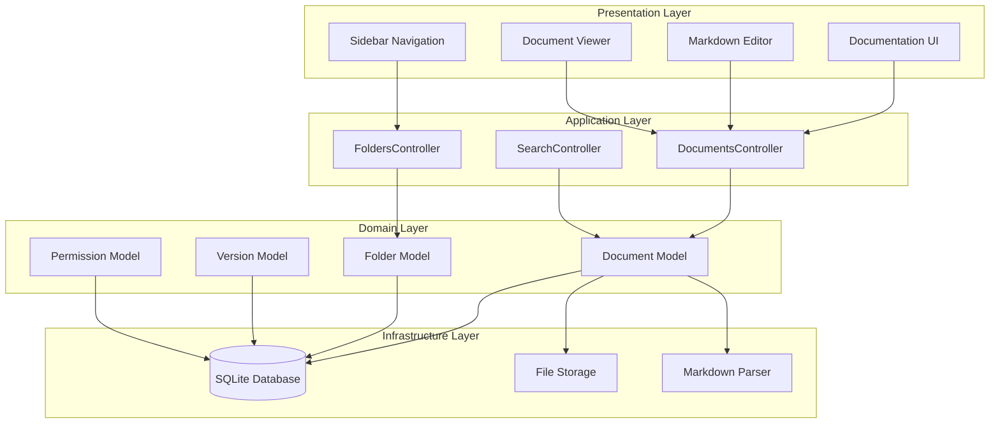
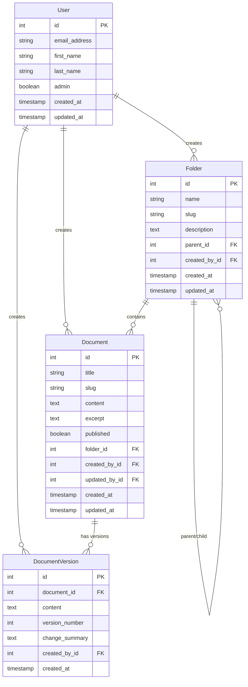

# Documentation Management System Design

## Overview

The Documentation Management System provides a comprehensive web-based interface for creating, organizing, and maintaining hierarchical documentation within the BMS Ops application. The system integrates seamlessly with the existing Rails application architecture, leveraging Active Record models, RESTful controllers, and the established UI patterns.

The system supports a hierarchical folder structure for organizing markdown documents, with role-based access control distinguishing between administrators (who can create and edit) and viewers (who can only read). All documentation is accessible through the existing sidebar navigation and maintains consistency with the application's design patterns.

## Architecture

### High-Level Architecture



### Integration with Existing System

The documentation system integrates with the existing BMS Ops architecture by:

- **Authentication**: Uses the existing `Authentication` concern and `User` model
- **Authorization**: Extends the user model with admin role capabilities
- **UI Patterns**: Follows established RailsUI patterns and Tailwind CSS styling
- **Navigation**: Integrates with the existing sidebar navigation structure
- **Error Handling**: Uses existing `ApplicationLogging` and error handling patterns

## Components and Interfaces

### Models

#### Document Model
```ruby
class Document < ApplicationRecord
  belongs_to :folder, optional: true
  belongs_to :created_by, class_name: 'User'
  belongs_to :updated_by, class_name: 'User'
  has_many :document_versions, dependent: :destroy
  has_one_attached :content_file
  
  validates :title, presence: true, length: { maximum: 255 }
  validates :slug, presence: true, uniqueness: { scope: :folder_id }
  validates :content, presence: true
  
  scope :published, -> { where(published: true) }
  scope :in_folder, ->(folder) { where(folder: folder) }
  
  before_validation :generate_slug
  after_update :create_version_if_content_changed
end
```

#### Folder Model
```ruby
class Folder < ApplicationRecord
  belongs_to :parent, class_name: 'Folder', optional: true
  has_many :children, class_name: 'Folder', foreign_key: 'parent_id', dependent: :destroy
  has_many :documents, dependent: :destroy
  belongs_to :created_by, class_name: 'User'
  
  validates :name, presence: true, length: { maximum: 255 }
  validates :slug, presence: true, uniqueness: { scope: :parent_id }
  
  scope :root_folders, -> { where(parent_id: nil) }
  
  before_validation :generate_slug
  validate :prevent_circular_references
end
```

#### DocumentVersion Model
```ruby
class DocumentVersion < ApplicationRecord
  belongs_to :document
  belongs_to :created_by, class_name: 'User'
  
  validates :content, presence: true
  validates :version_number, presence: true, uniqueness: { scope: :document_id }
  
  scope :ordered, -> { order(:version_number) }
end
```

### Controllers

#### DocumentsController
```ruby
class DocumentsController < ApplicationController
  before_action :require_admin_for_modifications, except: [:index, :show]
  before_action :set_document, only: [:show, :edit, :update, :destroy]
  before_action :set_folder, only: [:index, :new, :create]
  
  def index
    @documents = current_folder_documents.published.includes(:folder, :created_by)
  end
  
  def show
    @rendered_content = MarkdownRenderer.new(@document.content).to_html
  end
  
  def new
    @document = Document.new(folder: @folder)
  end
  
  def create
    @document = Document.new(document_params)
    @document.created_by = Current.user
    @document.updated_by = Current.user
    
    if @document.save
      redirect_to @document, notice: 'Document created successfully.'
    else
      render :new, status: :unprocessable_entity
    end
  end
  
  def edit
  end
  
  def update
    @document.updated_by = Current.user
    
    if @document.update(document_params)
      redirect_to @document, notice: 'Document updated successfully.'
    else
      render :edit, status: :unprocessable_entity
    end
  end
  
  def destroy
    @document.destroy
    redirect_to documents_path, notice: 'Document deleted successfully.'
  end
  
  private
  
  def require_admin_for_modifications
    redirect_to documents_path, alert: 'Access denied.' unless Current.user&.admin?
  end
end
```

#### FoldersController
```ruby
class FoldersController < ApplicationController
  before_action :require_admin, except: [:index, :show]
  before_action :set_folder, only: [:show, :edit, :update, :destroy]
  
  def index
    @root_folders = Folder.root_folders.includes(:children, :documents)
  end
  
  def show
    @documents = @folder.documents.published.includes(:created_by)
    @subfolders = @folder.children.includes(:documents)
  end
  
  def new
    @folder = Folder.new(parent_id: params[:parent_id])
  end
  
  def create
    @folder = Folder.new(folder_params)
    @folder.created_by = Current.user
    
    if @folder.save
      redirect_to @folder, notice: 'Folder created successfully.'
    else
      render :new, status: :unprocessable_entity
    end
  end
  
  private
  
  def require_admin
    redirect_to folders_path, alert: 'Access denied.' unless Current.user&.admin?
  end
end
```

### Services

#### MarkdownRenderer Service
```ruby
class MarkdownRenderer
  def initialize(content)
    @content = content
  end
  
  def to_html
    # Use Rails 8's built-in markdown processing with ActionText
    # This provides secure HTML rendering with XSS protection
    rendered_content = ActionText::Content.new(@content)
    
    # Convert markdown-style formatting to HTML
    html_content = simple_format(@content, {}, sanitize: false)
    
    # Apply basic markdown transformations
    html_content = apply_markdown_formatting(html_content)
    
    # Sanitize the output to prevent XSS attacks
    ActionText::Content.new(html_content).to_s.html_safe
  end
  
  private
  
  def apply_markdown_formatting(content)
    # Convert basic markdown syntax to HTML
    content = content.gsub(/\*\*(.*?)\*\*/, '<strong>\1</strong>') # Bold
    content = content.gsub(/\*(.*?)\*/, '<em>\1</em>') # Italic
    content = content.gsub(/`(.*?)`/, '<code>\1</code>') # Inline code
    content = content.gsub(/^# (.*?)$/, '<h1>\1</h1>') # H1
    content = content.gsub(/^## (.*?)$/, '<h2>\1</h2>') # H2
    content = content.gsub(/^### (.*?)$/, '<h3>\1</h3>') # H3
    content = content.gsub(/^\* (.*?)$/, '<li>\1</li>') # List items
    content = content.gsub(/\[([^\]]+)\]\(([^)]+)\)/, '<a href="\2">\1</a>') # Links
    
    # Wrap consecutive list items in ul tags
    content = content.gsub(/(<li>.*<\/li>)/m) { |match| "<ul>#{match}</ul>" }
    
    content
  end
end
```

#### DocumentSearchService
```ruby
class DocumentSearchService
  def initialize(query, user = nil)
    @query = query
    @user = user
  end
  
  def search
    return Document.none if @query.blank?
    
    documents = Document.published
    documents = documents.where(
      "title ILIKE ? OR content ILIKE ?", 
      "%#{@query}%", 
      "%#{@query}%"
    )
    
    documents.includes(:folder, :created_by).limit(50)
  end
end
```

## Data Models

### Database Schema

```sql
-- Folders table for hierarchical organization
CREATE TABLE folders (
  id INTEGER PRIMARY KEY,
  name VARCHAR(255) NOT NULL,
  slug VARCHAR(255) NOT NULL,
  description TEXT,
  parent_id INTEGER REFERENCES folders(id),
  created_by_id INTEGER NOT NULL REFERENCES users(id),
  created_at TIMESTAMP NOT NULL,
  updated_at TIMESTAMP NOT NULL,
  UNIQUE(slug, parent_id)
);

-- Documents table for markdown content
CREATE TABLE documents (
  id INTEGER PRIMARY KEY,
  title VARCHAR(255) NOT NULL,
  slug VARCHAR(255) NOT NULL,
  content TEXT NOT NULL,
  excerpt TEXT,
  published BOOLEAN DEFAULT false,
  folder_id INTEGER REFERENCES folders(id),
  created_by_id INTEGER NOT NULL REFERENCES users(id),
  updated_by_id INTEGER NOT NULL REFERENCES users(id),
  created_at TIMESTAMP NOT NULL,
  updated_at TIMESTAMP NOT NULL,
  UNIQUE(slug, folder_id)
);

-- Document versions for change tracking
CREATE TABLE document_versions (
  id INTEGER PRIMARY KEY,
  document_id INTEGER NOT NULL REFERENCES documents(id),
  content TEXT NOT NULL,
  version_number INTEGER NOT NULL,
  change_summary TEXT,
  created_by_id INTEGER NOT NULL REFERENCES users(id),
  created_at TIMESTAMP NOT NULL,
  UNIQUE(document_id, version_number)
);

-- Add admin role to users table
ALTER TABLE users ADD COLUMN admin BOOLEAN DEFAULT false;

-- Indexes for performance
CREATE INDEX idx_folders_parent_id ON folders(parent_id);
CREATE INDEX idx_documents_folder_id ON documents(folder_id);
CREATE INDEX idx_documents_published ON documents(published);
CREATE INDEX idx_document_versions_document_id ON document_versions(document_id);
CREATE INDEX idx_documents_search ON documents USING gin(to_tsvector('english', title || ' ' || content));
```

### Model Relationships



## Correctness Properties

*A property is a characteristic or behavior that should hold true across all valid executions of a system-essentially, a formal statement about what the system should do. Properties serve as the bridge between human-readable specifications and machine-verifiable correctness guarantees.*

Property 1: Document creation preserves location
*For any* valid folder and document data, creating a document in that folder should result in the document being retrievable from that exact folder location
**Validates: Requirements 1.1**

Property 2: Folder creation adds to hierarchy
*For any* valid folder data and parent folder, creating a folder should result in it appearing in the document hierarchy and being available for document organization
**Validates: Requirements 1.2**

Property 3: Document movement preserves content integrity
*For any* document and any two valid folders, moving the document from one folder to another should preserve all document content and metadata while updating the location
**Validates: Requirements 1.3**

Property 4: Folder deletion validation
*For any* folder, deletion should be prevented if the folder contains documents, and allowed if the folder is empty
**Validates: Requirements 1.4**

Property 5: Rename operations preserve references
*For any* document or folder, renaming should update the hierarchy display while maintaining all existing internal links and references
**Validates: Requirements 1.5**

Property 6: Markdown content round trip
*For any* valid markdown content, saving then retrieving a document should return exactly the same content with formatting preserved
**Validates: Requirements 2.2**

Property 7: Document editing preserves content
*For any* existing document, loading it for editing and saving without changes should preserve all original content and formatting
**Validates: Requirements 2.3**

Property 8: File upload generates valid references
*For any* uploaded file, the system should store it in the appropriate location and generate proper markdown references that resolve correctly
**Validates: Requirements 2.4**

Property 9: Markdown rendering produces valid HTML
*For any* valid markdown content, rendering using Rails 8's ActionText-based system should produce valid, sanitized HTML output with proper styling and formatting
**Validates: Requirements 2.5**

Property 10: Hierarchy display completeness
*For any* document hierarchy, accessing the documentation menu should display all folders and documents that the user has permission to view
**Validates: Requirements 3.1**

Property 11: Document rendering consistency
*For any* document, clicking on it in navigation should render the same content as accessing it directly via URL
**Validates: Requirements 3.2**

Property 12: Search result relevance
*For any* search query and document collection, search results should contain only documents that match the query in title or content
**Validates: Requirements 3.4**

Property 13: Access control enforcement
*For any* user without administrator privileges, attempts to edit any document should be denied with appropriate error messaging
**Validates: Requirements 4.1**

Property 14: Permission enforcement consistency
*For any* document with visibility permissions set, non-administrator users should only be able to access documents they have explicit permission to view
**Validates: Requirements 4.2**

Property 15: Document visibility filtering
*For any* user accessing the documentation system, they should only see documents they have permission to view based on their role and document permissions
**Validates: Requirements 4.3**

Property 16: Administrator-only access control
*For any* document marked as administrator-only, only users with administrator privileges should be able to access it
**Validates: Requirements 4.5**

Property 17: Search result completeness
*For any* search query, results should include document titles, excerpts, and hierarchy location for each matching document
**Validates: Requirements 5.2**

Property 18: Breadcrumb accuracy
*For any* document location in the hierarchy, breadcrumb navigation should show the complete and accurate path from root to current document
**Validates: Requirements 5.3**

Property 19: URL persistence
*For any* document, its URL should remain accessible and point to the same document even after system restarts or cache clearing
**Validates: Requirements 5.4**

Property 20: Folder metadata accuracy
*For any* folder in the hierarchy, the system should accurately display whether it contains documents and show correct document counts
**Validates: Requirements 5.5**

Property 21: Change tracking completeness
*For any* document modification, the system should record the change timestamp, author, and modification summary
**Validates: Requirements 6.1**

Property 22: History display accuracy
*For any* document with change history, viewing the history should display all changes in chronological order with complete author information
**Validates: Requirements 6.2**

Property 23: Version comparison accuracy
*For any* two versions of a document, comparing them should accurately highlight all differences between the versions
**Validates: Requirements 6.3**

Property 24: Version restoration integrity
*For any* document version, restoring it should replace the current content with the selected version while preserving the complete change history
**Validates: Requirements 6.4**

Property 25: Soft deletion and recovery
*For any* deleted document, the deletion should be recorded and the document should be recoverable by administrators
**Validates: Requirements 6.5**

Property 26: Authentication integration consistency
*For any* user accessing documentation, the system should use the same authentication and session management as the main application
**Validates: Requirements 7.1**

Property 27: Error handling consistency
*For any* error condition in the documentation system, error handling and flash messages should follow the same patterns as the main application
**Validates: Requirements 7.5**

<function_calls>
<invoke name="prework">
<parameter name="featureName">documentation-management

## Error Handling

### Validation Errors
- **Document Creation**: Validate title presence, slug uniqueness, content presence
- **Folder Creation**: Validate name presence, slug uniqueness, prevent circular references
- **File Uploads**: Validate file types, size limits, storage availability
- **Permission Checks**: Validate user roles before allowing modifications

### System Errors
- **Database Errors**: Handle connection issues, constraint violations, transaction failures
- **File System Errors**: Handle storage failures, permission issues, disk space problems
- **Markdown Parsing Errors**: Handle invalid markdown syntax, rendering failures
- **Search Errors**: Handle search service unavailability, query parsing issues

### Error Response Patterns
```ruby
# Controller error handling
rescue_from ActiveRecord::RecordNotFound do |exception|
  redirect_to documents_path, alert: 'Document not found.'
end

rescue_from ActiveRecord::RecordInvalid do |exception|
  render :edit, status: :unprocessable_entity, locals: { errors: exception.record.errors }
end

# Service error handling
class DocumentSearchService
  def search
    # ... search logic
  rescue StandardError => e
    Rails.logger.error "Search failed: #{e.message}"
    Document.none
  end
end
```

## Testing Strategy

### Dual Testing Approach

The documentation system requires both unit testing and property-based testing to ensure comprehensive coverage:

**Unit Tests** verify specific examples, edge cases, and error conditions:
- Document CRUD operations with specific data
- Folder hierarchy operations
- Permission checking with known user roles
- Markdown rendering with specific content examples
- Integration points between components

**Property-Based Tests** verify universal properties using the Rantly gem:
- Document creation and retrieval across all valid inputs
- Folder hierarchy integrity with random structures
- Permission enforcement across all user/document combinations
- Search functionality with random queries and content
- Version control operations with random document changes

### Property-Based Testing Configuration

The system will use the Rantly gem for property-based testing with the following configuration:
- **Minimum iterations**: 100 per property test to ensure statistical confidence
- **Test tagging**: Each property test will include a comment referencing the specific correctness property from this design document
- **Format**: `**Feature: documentation-management, Property {number}: {property_text}**`
- **Markdown Testing**: Property tests will validate that Rails 8's ActionText-based markdown rendering produces consistent, secure HTML output

### Unit Testing Areas

**Model Testing**:
- Document validation and associations
- Folder hierarchy and circular reference prevention
- User role and permission checking
- Version creation and management

**Controller Testing**:
- Authentication and authorization flows
- CRUD operations with proper error handling
- Search functionality and result formatting
- File upload and attachment handling

**Service Testing**:
- Markdown rendering with various content types
- Search service with different query patterns
- Permission checking across user roles
- Version comparison and restoration

**Integration Testing**:
- End-to-end document creation and editing workflows
- Navigation and hierarchy display
- Search functionality across the full system
- Permission enforcement in realistic scenarios

### Testing Data Generation

Property-based tests will use smart generators that:
- Generate valid markdown content with various formatting
- Create realistic folder hierarchies with appropriate depth
- Generate users with different permission levels
- Create document content with searchable terms
- Generate file uploads with various types and sizes

The testing strategy ensures that both specific use cases (unit tests) and general system behavior (property tests) are thoroughly validated, providing confidence in the system's correctness and reliability.